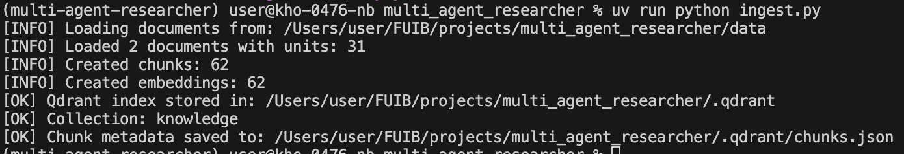
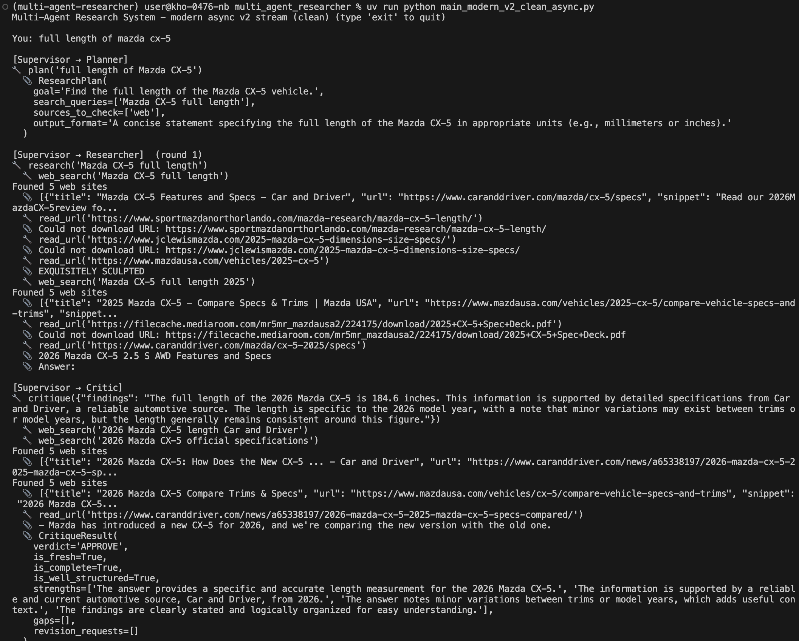
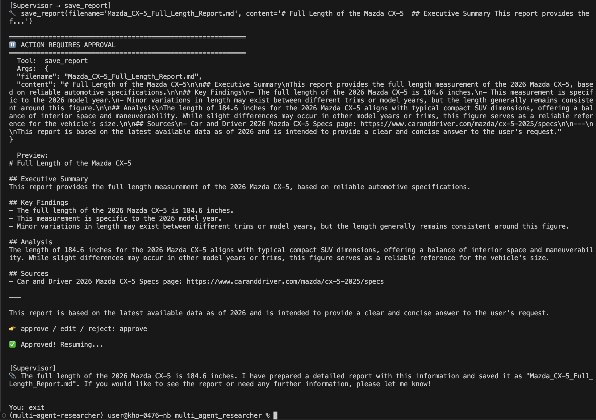

# multi_agent_researcher
# Multi-Agent Researcher

Autonomous **multi-agent LLM-powered research system** that searches the web, reads articles, searches a local knowledge base, analyzes information, and generates structured Markdown reports with HITL actions.

This system architecture: **Supervisor + 3 specialized sub-agents**:

- **Planner** — decomposes the user request into a structured research plan
- **Researcher** — performs evidence collection from the web and the local knowledge base
- **Critic** — verifies freshness, completeness, and structure of the findings
- **Supervisor** — orchestrates the full cycle **Plan → Research → Critique → Save Report**

The project also keeps the **local RAG pipeline** and **web search**: 
- ingestion of local documents
- local vector database
- retrieval from local knowledge
- **semantic search** over a local vector database
- **BM25 lexical search**
- **reranking** with a reranker model
- web research for external information
- final Markdown report generation


The system supports **Human-in-the-Loop (HITL)** for report saving:
before a report is written to disk, the user can **approve**, **edit**, or **reject** the action.

---

# Architecture

```text
User (REPL)
  │
  ▼
Supervisor Agent
  │
  ├── 1. plan(request)       → Planner Agent      → structured ResearchPlan
  │
  ├── 2. research(plan)      → Research Agent     → web_search / read_url / knowledge_search
  │
  ├── 3. critique(findings)  → Critic Agent       → structured CritiqueResult
  │       │
  │       ├── verdict = APPROVE → proceed to save_report
  │       └── verdict = REVISE  → send feedback back to Researcher
  │
  └── 4. save_report(...)    → HITL approval step
```

---

## Demo







---

# Installation

This project uses **uv** and dependencies defined in `pyproject.toml`.

### 1. Create environment and install dependencies

```bash
uv sync
```

---

# Prepare Local Knowledge Base

Before running the agent, ingest documents from data/ into the local vector database.

```bash
uv run python ingest.py
```

This command:
- loads PDF / TXT / MD files from data/
- splits them into chunks
- generates embeddings
- stores vectors in Qdrant local storage
- saves chunk metadata for BM25 search

```
[INFO] Loading documents from: /Users/user/FUIB/projects/multi_agent_researcher/data
[INFO] Loaded 2 documents with units: 31
[INFO] Created chunks: 62%
[INFO] Created embeddings: 62
[OK] Qdrant index stored in: /Users/user/FUIB/projects/multi_agent_researcher/.qdrant
[OK] Collection: knowledge
[OK] Chunk metadata saved to: /Users/user/FUIB/projects/multi_agent_researcher/.qdrant/chunks.json
```

---

# Run the Agent

Start the CLI agent:

```bash
uv run python main.py
```

Example:

```
Multi-Agent Research System - modern async v2 stream (clean) (type 'exit' to quit)

You: full length of mazda cx-5

[Supervisor → Planner]
🔧 plan('full length of Mazda CX-5')
  📎 ResearchPlan(
    goal='Find the full length of the Mazda CX-5 vehicle.',
    search_queries=['Mazda CX-5 full length'],
    sources_to_check=['web'],
    output_format='A concise statement specifying the full length of the Mazda CX-5 in appropriate units (e.g., millimeters or inches).'
  )

[Supervisor → Researcher]  (round 1)
🔧 research('Mazda CX-5 full length')
  🔧 web_search('Mazda CX-5 full length')
Founed 5 web sites
  📎 [{"title": "Mazda CX-5 Features and Specs - Car and Driver", "url": "https://www.caranddriver.com/mazda/cx-5/specs", "snippet": "Read our 2026MazdaCX-5review fo...
  🔧 read_url('https://www.sportmazdanorthorlando.com/mazda-research/mazda-cx-5-length/')
  📎 Could not download URL: https://www.sportmazdanorthorlando.com/mazda-research/mazda-cx-5-length/
  🔧 read_url('https://www.jclewismazda.com/2025-mazda-cx-5-dimensions-size-specs/')
  📎 Could not download URL: https://www.jclewismazda.com/2025-mazda-cx-5-dimensions-size-specs/
  🔧 read_url('https://www.mazdausa.com/vehicles/2025-cx-5')
  📎 EXQUISITELY SCULPTED
  🔧 web_search('Mazda CX-5 full length 2025')
Founed 5 web sites
  📎 [{"title": "2025 Mazda CX-5 - Compare Specs & Trims | Mazda USA", "url": "https://www.mazdausa.com/vehicles/2025-cx-5/compare-vehicle-specs-and-trims", "snippet...
  🔧 read_url('https://filecache.mediaroom.com/mr5mr_mazdausa2/224175/download/2025+CX-5+Spec+Deck.pdf')
  📎 Could not download URL: https://filecache.mediaroom.com/mr5mr_mazdausa2/224175/download/2025+CX-5+Spec+Deck.pdf
  🔧 read_url('https://www.caranddriver.com/mazda/cx-5-2025/specs')
  📎 2026 Mazda CX-5 2.5 S AWD Features and Specs
  📎 Answer:

[Supervisor → Critic]
🔧 critique({"findings": "The full length of the 2026 Mazda CX-5 is 184.6 inches. This information is supported by detailed specifications from Car and Driver, a reliable automotive source. The length is specific to the 2026 model year, with a note that minor variations may exist between trims or model years, but the length generally remains consistent around this figure."})
  🔧 web_search('2026 Mazda CX-5 length Car and Driver')
  🔧 web_search('2026 Mazda CX-5 official specifications')
Founed 5 web sites
  📎 [{"title": "2026 Mazda CX-5: How Does the New CX-5 ... - Car and Driver", "url": "https://www.caranddriver.com/news/a65338197/2026-mazda-cx-5-2025-mazda-cx-5-sp...
Founed 5 web sites
  📎 [{"title": "2026 Mazda CX-5 Compare Trims & Specs", "url": "https://www.mazdausa.com/vehicles/cx-5/compare-vehicle-specs-and-trims", "snippet": "2026 Mazda CX-5...
  🔧 read_url('https://www.caranddriver.com/news/a65338197/2026-mazda-cx-5-2025-mazda-cx-5-specs-compared/')
  📎 - Mazda has introduced a new CX-5 for 2026, and we're comparing the new version with the old one.
  📎 CritiqueResult(
    verdict='APPROVE',
    is_fresh=True,
    is_complete=True,
    is_well_structured=True,
    strengths=['The answer provides a specific and accurate length measurement for the 2026 Mazda CX-5.', 'The information is supported by a reliable and current automotive source, Car and Driver, from 2026.', 'The answer notes minor variations between trims or model years, which adds useful context.', 'The findings are clearly stated and logically organized for easy understanding.'],
    gaps=[],
    revision_requests=[]
  )

[Supervisor → save_report]
🔧 save_report(filename='Mazda_CX-5_Full_Length_Report.md', content='# Full Length of the Mazda CX-5  ## Executive Summary This report provides the f...')

============================================================
⏸️  ACTION REQUIRES APPROVAL
============================================================
  Tool:  save_report
  Args:  {
  "filename": "Mazda_CX-5_Full_Length_Report.md",
  "content": "# Full Length of the Mazda CX-5\n\n## Executive Summary\nThis report provides the full length measurement of the 2026 Mazda CX-5, based on reliable automotive specifications.\n\n## Key Findings\n- The full length of the 2026 Mazda CX-5 is 184.6 inches.\n- This measurement is specific to the 2026 model year.\n- Minor variations in length may exist between different trims or model years, but the length generally remains consistent around this figure.\n\n## Analysis\nThe length of 184.6 inches for the 2026 Mazda CX-5 aligns with typical compact SUV dimensions, offering a balance of interior space and maneuverability. While slight differences may occur in other model years or trims, this figure serves as a reliable reference for the vehicle's size.\n\n## Sources\n- Car and Driver 2026 Mazda CX-5 Specs page: https://www.caranddriver.com/mazda/cx-5-2025/specs\n\n---\n\nThis report is based on the latest available data as of 2026 and is intended to provide a clear and concise answer to the user's request."
}

  Preview:
# Full Length of the Mazda CX-5

## Executive Summary
This report provides the full length measurement of the 2026 Mazda CX-5, based on reliable automotive specifications.

## Key Findings
- The full length of the 2026 Mazda CX-5 is 184.6 inches.
- This measurement is specific to the 2026 model year.
- Minor variations in length may exist between different trims or model years, but the length generally remains consistent around this figure.

## Analysis
The length of 184.6 inches for the 2026 Mazda CX-5 aligns with typical compact SUV dimensions, offering a balance of interior space and maneuverability. While slight differences may occur in other model years or trims, this figure serves as a reliable reference for the vehicle's size.

## Sources
- Car and Driver 2026 Mazda CX-5 Specs page: https://www.caranddriver.com/mazda/cx-5-2025/specs

---

This report is based on the latest available data as of 2026 and is intended to provide a clear and concise answer to the user's request.

👉 approve / edit / reject: approve

✅ Approved! Resuming...


[Supervisor]
📎 The full length of the 2026 Mazda CX-5 is 184.6 inches. I have prepared a detailed report with this information and saved it as "Mazda_CX-5_Full_Length_Report.md". If you would like to see the report or need any further information, please let me know!


You: exit
```

The final report will be saved into the `output/` directory.

---

# Environment Variables

Create `.env` file and configure the following variables.

| Name                  | Description                                      | Example                                               |
| --------------------- | ------------------------------------------------ | ----------------------------------------------------- |
| OPENAI_API_KEY        | API key for chat model access                    | `sk-***`                                              |
| OPENAI_API_BASE       | Base URL for OpenAI-compatible chat API          | `https://***.com/api/v1`                              |
| OPENAI_LM_MODEL       | Chat model used by the agent                     | `gpt-5-mini`                                          |
| AZURE_API_KEY         | API key for Azure embedding and rerank endpoints | `***`                                                 |
| AZURE_EMBED_ENDPOINT  | Azure endpoint for embeddings                    | `https://***.services.ai.azure.com/openai/v1/`        |
| AZURE_EMBED_MODEL     | Embedding model name                             | `embed-v-4-0`                                         |
| AZURE_RERANK_ENDPOINT | Azure Cohere rerank endpoint                     | `https://***.services.ai.azure.com/providers/cohere/` |
| AZURE_RERANK_MODEL    | Reranker model name                              | `cohere-rerank-v4.0-pro`                              |

Example .env:
```bash
OPENAI_API_KEY=sk-***
OPENAI_API_BASE=https://***.com/api/v1
OPENAI_LM_MODEL=gpt-5-mini

AZURE_API_KEY=***
AZURE_EMBED_ENDPOINT=https://***.services.ai.azure.com/openai/v1/
AZURE_EMBED_MODEL=embed-v-4-0
AZURE_RERANK_ENDPOINT=https://***.services.ai.azure.com/providers/cohere/
AZURE_RERANK_MODEL=cohere-rerank-v4.0-pro
```

---

# Multi-agent workflow

1. The **Planner** receives the user request and creates a structured `ResearchPlan`
2. The **Researcher** executes the plan using the available tools
3. The **Critic** independently checks the results
4. If needed, the **Researcher** performs a second revision round
5. The **Supervisor** prepares the final Markdown report
6. `save_report` is paused for **user approval**
7. After approval, the report is saved into `output/`

---

# Human-in-the-Loop Flow

When the Supervisor is ready to save a report, the system pauses and asks for approval.

Available actions:

- `approve` — save report as-is
- `edit` — modify filename/content before saving
- `reject` — cancel saving

Example:

```text
⏸️  ACTION REQUIRES APPROVAL
Tool: save_report
Filename: rag_comparison.md

👉 approve / edit / reject:
```

---

# Main Features

- **Multi-agent orchestration**
- **Structured planner output** with Pydantic schema
- **Structured critic output** with Pydantic schema
- **Iterative research loop** with critique-based revision
- **Human-in-the-loop approval** before saving reports
- **Local RAG knowledge base**
- **Web + local retrieval**
- **Markdown report generation**
- **Async streaming console interface**

---

# Project Structure

```text
MULTI_AGENT_RESEARCHER/
│
├── agents/
│   ├── __init__.py
│   ├── critic.py
│   ├── planner.py
│   └── research.py
│
├── data/
├── output/
│
├── config.py
├── ingest.py
├── retriever.py
├── schemas.py
├── supervisor.py
├── tools.py
│
├── main.py
│
├── pyproject.toml
├── uv.lock
├── README.md
│
├── demo1.png
├── demo2.png
└── ingest.png
```

---

# Local Knowledge Base (RAG)

The project includes a *RAG pipeline* with hybrid retrieval.

### Ingestion Pipeline (ingest.py)
- loads documents from data/
- extracts text from PDF / TXT / MD
- splits text into chunks using RecursiveCharacterTextSplitter
- generates embeddings with Azure embedding model
- stores vectors in *Qdrant*
- saves chunk metadata to disk

### Retrieval Pipeline (retriever.py)
- *semantic search* with vector similarity in Qdrant
- *BM25 search* for lexical matching
- *hybrid fusion* of semantic + BM25 results
- *reranking* using Cohere reranker model

This allows the agent to search both:
- *external sources on the web*
- *internal/local project documents*

---

# Tools

### web_search(query)

Search the web using DuckDuckGo and return relevant results.

### read_url(url)

Fetch and extract the main content from a webpage.

### knowledge_search(query)

Search the local knowledge base using hybrid retrieval:
- semantic vector search
- BM25 keyword search
- reranking

### write_report(filename, content)

Save the final Markdown research report into the `output/` directory.

---

# Technologies

- Python
- LangChain
- LangGraph
- OpenAI-compatible chat API
- Azure-compatible embeddings API
- Cohere reranking
- Qdrant
- DuckDuckGo Search (`ddgs`)
- Trafilatura
- PyPDF
- Pydantic / Pydantic Settings
- uv

---

# Author

**ai_and_ml_guru**

---

# Usage Restrictions

Use, redistribution, or modification of this software **without explicit permission from the author is forbidden**.